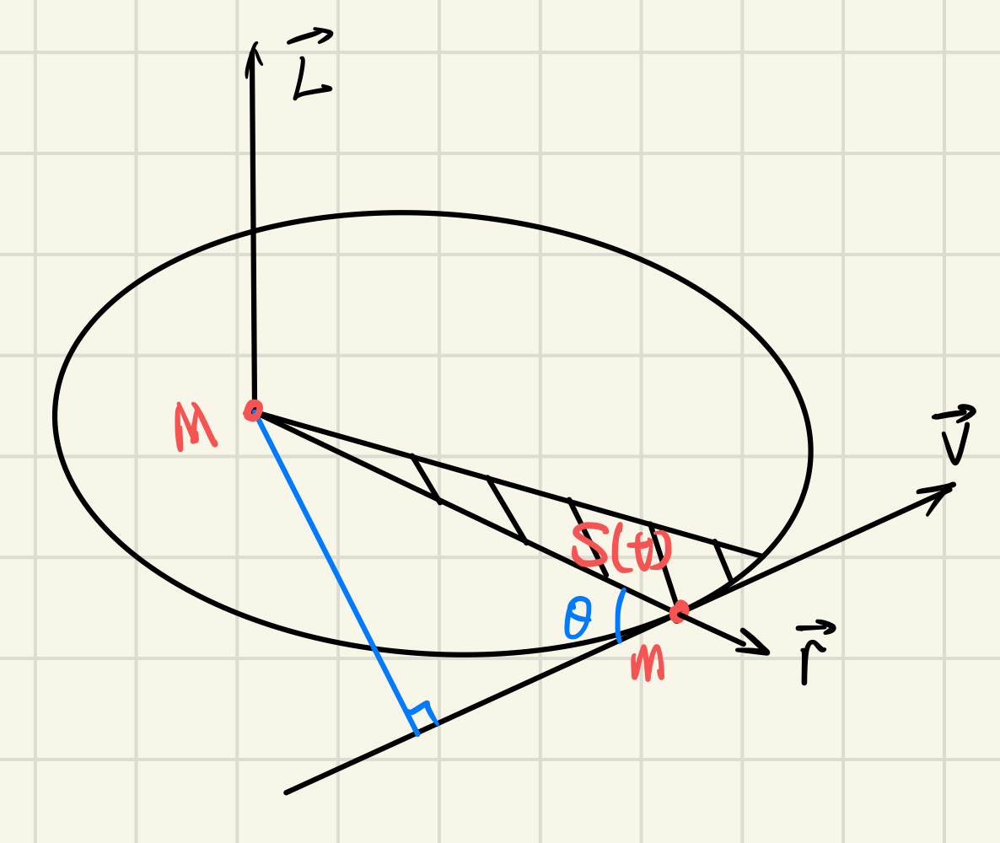

# 开普勒第二定律

## 定律内容：

行星与所围绕恒星的连线在单位时间内扫过的面积为定值。

## 使用角动量守恒推导：

记行星质量为$m$，恒星质量为$M$，行星与所围绕恒星的连线随时间扫过的面积为$S$，则可以绘制如下示意图：

则定理内容可以转换为：

$$
\begin{equation}
    \frac{\mathrm{d} S}{\mathrm{d} t} \equiv C
\end{equation}
$$

即该面积随时间变化率恒定。记行星运行速度为$\vec{v} (t)$，相对于恒星的位置为$\vec{r}(t)$，两向量夹角为$\theta(t)$。当$\Delta t \to 0$时，三角形面积为：

$$
\begin{equation}
\begin{split}
\Delta S
& = \frac{1}{2} (\left \| \vec{r} \right \|\sin \theta )(\left \| \vec{v} \right \|  \Delta t) \\
& = \frac{1}{2} \left \| \vec{r} \times \vec{v} \right \| \Delta t
\end{split} 
\end{equation} 
$$

注意到行星对于恒星为参考点的角动量有：

$$
\begin{equation}
\begin{split}
\vec{L}
& = \vec{r}\times\vec{p} \\
& = \vec{r}\times(m\vec{v}) \\
& = m(\vec{r}\times\vec{v})
\end{split}
\end{equation}
$$

将公式(3)带入公式(2)，有：

$$
\begin{equation}
\begin{split}
\frac{\mathrm{d} S(t)}{\mathrm{d} t} 
& = \lim_{\Delta t \to 0} \frac{\Delta S}{\Delta t} \\
& = \frac{\left \| \vec{L} \right \|}{2m}
\end{split} 
\end{equation} 
$$

由于行星绕恒星运行时，仅受到恒星的引力，引力方向指向参考点，因此行星相对于恒星的角动量守恒，$\left \| \vec{L} \right \|$为定值；另外运行期间行星质量不变，$m$为定值，进一步公式(4)为定值，定律得证。

## 参考文献：

[1] [牛顿以前的物理定律：证明开普勒第二，第三定律_哔哩哔哩_bilibili](https://www.bilibili.com/video/BV18T41137ZE/?spm_id_from=333.788&vd_source=bc6b96f6d66ac3764e5f64916cbd02bd)
